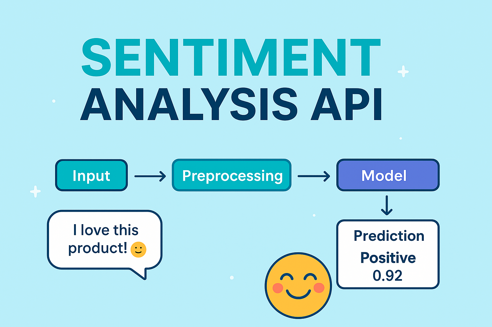

# 📝 Sentiment Analysis API 🚀

A **production-ready FastAPI service** for predicting the **sentiment of text (Positive, Negative, Neutral)**.
This project combines **natural language preprocessing** with a **machine learning model (SVM + Bag of Words)**, wrapped in a secure and scalable **REST API**.

<p align="center">
  
</p>

---

## ✨ Features

✅ **Preprocessing pipeline**: cleans noisy text (URLs, emoticons, extra chars, redundant words, lemmatization).
✅ **Machine Learning powered**: uses a trained **Support Vector Machine (SVM)** classifier.
✅ **Security**: requires an API key (`X-API-Key`) for requests.
✅ **FastAPI**: blazing-fast, interactive Swagger docs (`/docs`).
✅ **Structured responses**: clean JSON with sentiment & confidence score.
✅ **Reusable**: can be easily integrated into chatbots, dashboards, or social media monitoring tools.

---

## ⚙️ Project Structure

```
sentiment-full-project-with-processing/
│── main.py                 # FastAPI app (routes, security, API setup)
│── .env.example            # Environment variables template
│── src/
│   ├── config.py           # Configurations, model & vectorizer loading, mappings
│   ├── utils/
│   │   └── text_processor.py   # Text cleaning & preprocessing pipeline
│   ├── models/
│   │   ├── inference.py    # Sentiment prediction logic
│   │   └── schemas.py      # Pydantic models (request/response)
│   └── notebooks/          # Dataset & experiments used for training
│── artifacts/
│   ├── bow_vectorizer.pkl  # Bag-of-Words vectorizer
│   └── svm_bow.pkl         # Trained SVM model
```

---

## 🛠️ Installation & Setup

1. **Clone this repository**

```bash
git clone https://github.com/asmaa-2ahmed/sentiment_analysis.git
cd sentiment_analysis
```

2. **Create & activate virtual environment**

```bash
python -m venv venv
source venv/bin/activate   # On Linux/Mac
venv\Scripts\activate      # On Windows
```

3. **Install dependencies**

```bash
pip install -r requirements.txt
```

4. **Setup environment variables**
   Copy `.env.example` → `.env` and fill in your values:

```env
APP_NAME="Text-Classification"
VERSION="1.0.0"
API_SECRET_KEY="your-secret-key"
```

5. **Run the API**

```bash
uvicorn main:app --reload
```

---

## 🚀 Usage

### 🔹 Health Check

```bash
curl http://127.0.0.1:8000/health
```

Response:

```json
{
  "status": "ok",
  "app_name": "Text-Classification",
  "version": "1.0.0"
}
```

### 🔹 Sentiment Prediction

Send a `POST` request with API key:

```bash
curl -X POST "http://127.0.0.1:8000/predict" -H "Content-Type: application/json" -H "X-API-Key: your-secret-key" -d '{"text": "I love this product! :)"}'
```

Response:

```json
{
  "sentiment": "Positive",
  "confidence": 0.92
}
```

---

## 🧩 How It Works

1. **Input Text** → `"I love this product! :)"`
2. **Preprocessing** (`TextProcessor`) → `"love product happy"`
3. **Vectorization** (Bag-of-Words) → Converts text into numeric features.
4. **Model Prediction** (SVM) → Predicts sentiment label (`1`).
5. **Mapping** → `1 → Positive`.
6. **API Response** → JSON with sentiment + confidence.

---

## 📊 Model & Dataset

* **Model**: Support Vector Machine (SVM)
* **Vectorizer**: Bag-of-Words
* **Dataset**: Twitter sentiment dataset (cleaned & preprocessed).
* **Classes**:

  * `0 → Negative`
  * `1 → Positive`
  * `2 → Neutral`

---

## 📚 Example Use Cases

🔹 **Customer feedback analysis**
🔹 **Social media monitoring**
🔹 **Chatbot sentiment-aware responses**
🔹 **Product review classification**

---

## 🛡️ Security

All requests must include a valid API Key in headers:

```http
X-API-Key: your-secret-key
```

---

## 🤝 Contributing

Want to improve this project? Fork it, create a feature branch, and submit a PR 🚀

---

## 📜 License

This project is licensed under the **MIT License** – feel free to use and modify!

---

💡 *Built with love using Python, FastAPI & Scikit-learn* ❤️
